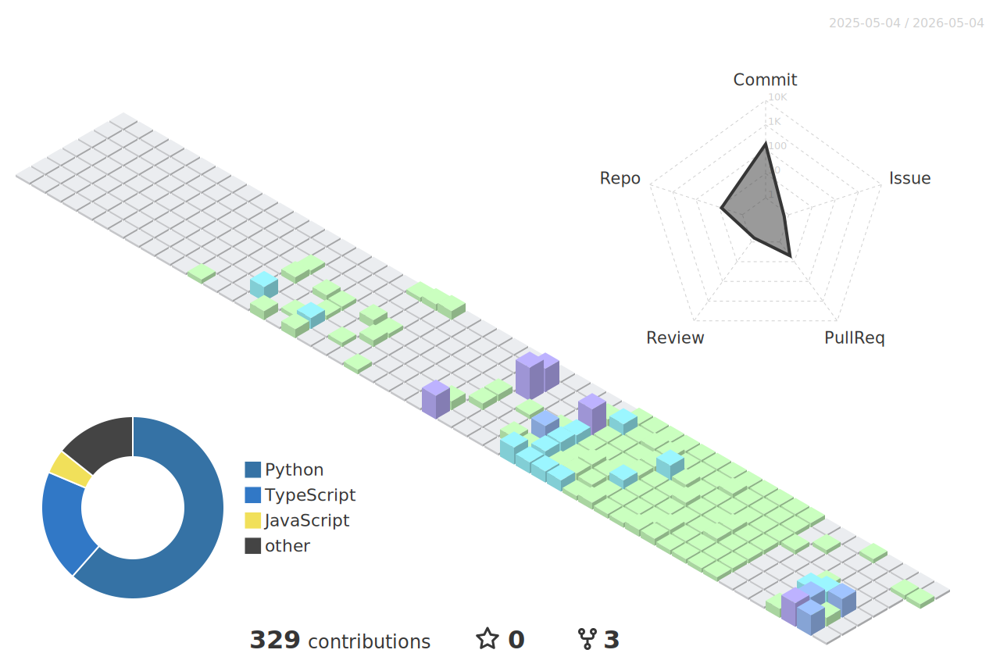

  
  
  
    
  
  <!-- Typing Animation -->
  
  
   
  
  <!-- Profile Views & Followers -->
  
  &nbsp;
  
  
    
  
  <!-- Social Links -->
  
  &nbsp;
  
  &nbsp;
  

---

## ☕ Cozy Quick Stats

  <picture>
    <source media="(prefers-color-scheme: dark)" srcset="https://github-readme-stats.vercel.app/api?username=charithra754-boop&show_icons=true&hide_border=true&bg_color=211C19&title_color=FAF8F5&icon_color=b5927e&text_color=EBE3D5&rank_icon=github">
    <source media="(prefers-color-scheme: light)" srcset="https://github-readme-stats.vercel.app/api?username=charithra754-boop&show_icons=true&hide_border=true&bg_color=FAF8F5&title_color=3E322D&icon_color=8C766C&text_color=5C4D46&rank_icon=github">
    
  </picture>
  &nbsp;
  <picture>
    <source media="(prefers-color-scheme: dark)" srcset="https://github-readme-streak-stats.herokuapp.com/?user=charithra754-boop&hide_border=true&background=211C19&ring=b5927e&fire=EAD1CD&currStreakLabel=EBE3D5&sideNums=FAF8F5&sideLabels=b5927e&dates=d1c2b4">
    <source media="(prefers-color-scheme: light)" srcset="https://github-readme-streak-stats.herokuapp.com/?user=charithra754-boop&hide_border=true&background=FAF8F5&ring=b5927e&fire=e5c1bd&currStreakLabel=5C4D46&sideNums=3E322D&sideLabels=8C766C&dates=705E55">
    
  </picture>

 

## 🎨 Featured Projects

<table width="100%">
  <tr>
    <td width="50%" valign="top">
      <h3 align="center" style="color: #3e322d;">🫀 CortexCore: Neuromorphic ECG</h3>
      

        <i>"The future of heart health, powered by AI!"</i> ⚡ 
        An SNN for clinical ECG analysis, reducing power by 60% (100mW→40mW) for edge deployment. Achieved 89.16% G-mean accuracy for arrhythmia detection with ultra-low 47ms latency.
      

      

        
        
        
      

    </td>
    <td width="50%" valign="top">
      <h3 align="center" style="color: #3e322d;">🛰️ Project Astraeus: Digital Twin</h3>
      

        <i>"Navigating the cosmos with intelligent autonomy!"</i> 🌌 
        Optimized satellite data scheduling with a PPO agent (+23.4% throughput). Engineered a physics-accurate 3D Digital Twin (CesiumJS) for sub-second telemetry processing.
      

      

        
        
        
      

    </td>
  </tr>
  <tr>
    <td width="50%" valign="top">
      <h3 align="center" style="color: #3e322d;">🧠 FinPilot: Multi-Agent System</h3>
      

        <i>"Smart money, smarter decisions!"</i> 📈 
        Designed a 6-agent system for autonomous financial logic, with 80%+ test coverage and 100% auditability via an interactive "ReasonGraph" visualization dashboard.
      

      

        
        
        
      

    </td>
    <td width="50%" valign="top">
      <h3 align="center" style="color: #3e322d;">🌾 KisaanMitra: Agri-Ecosystem</h3>
      

        <i>"Harvesting innovation for a greener future!"</i> 🚜 
        Developed a 7-agent ecosystem for satellite yield forecasting & autonomous irrigation. Empowered Indian smallholders, targeting 16-40% post-harvest loss reduction.
      

      

        
        
        
      

    </td>
  </tr>
  <tr>
    <td colspan="2" valign="top">
      <h3 align="center" style="color: #3e322d;">🔗 Aya Wallet Integration</h3>
      

        <i>"Bridging AI and blockchain, seamlessly!"</i> 🌐 
        Built a custom Model Context Protocol (MCP) tool verified into the Aya Wallet Universe. Achieved ~40% interaction efficiency by connecting AI agents with blockchain data via NLPs.
      

      

        
        
        
      

    </td>
  </tr>
</table>

 

### 📜 Recent Activity
<!--START_SECTION:activity-->
1. 🎉 Merged PR [#2](https://github.com/MUKUL-PRASAD-SIGH/AetherSentrix-Trial/pull/2) in [MUKUL-PRASAD-SIGH/AetherSentrix-Trial](https://github.com/MUKUL-PRASAD-SIGH/AetherSentrix-Trial)
2. 💪 Opened PR [#2](https://github.com/MUKUL-PRASAD-SIGH/AetherSentrix-Trial/pull/2) in [MUKUL-PRASAD-SIGH/AetherSentrix-Trial](https://github.com/MUKUL-PRASAD-SIGH/AetherSentrix-Trial)
3. 🎉 Merged PR [#1](https://github.com/MUKUL-PRASAD-SIGH/AetherSentrix-Trial/pull/1) in [MUKUL-PRASAD-SIGH/AetherSentrix-Trial](https://github.com/MUKUL-PRASAD-SIGH/AetherSentrix-Trial)
4. 💪 Opened PR [#1](https://github.com/MUKUL-PRASAD-SIGH/AetherSentrix-Trial/pull/1) in [MUKUL-PRASAD-SIGH/AetherSentrix-Trial](https://github.com/MUKUL-PRASAD-SIGH/AetherSentrix-Trial)
<!--END_SECTION:activity-->

 

## 🛠️ Tech Arsenal

### Languages

### AI/ML & Data

### Web & Cloud

### Tools & Others

 

## 🌱 Currently Exploring

  <table style="border: none; border-collapse: collapse; background: transparent;">
    <tr style="border: none;">
      <td style="border: none; padding: 15px; vertical-align: top; width: 33%;">
        <h4 align="center" style="color: #705e55; font-family: monospace;">🎨 Art &amp; Brains</h4>
        

          • Spiking Neural Networks 
          • Intel Loihi Neuromorphic 
          • Edge AI Optimization
        

      </td>
      <td style="border: none; padding: 15px; vertical-align: top; width: 33%;">
        <h4 align="center" style="color: #705e55; font-family: monospace;">🎸 Music &amp; Chains</h4>
        

          • Smart Contract Security 
          • Zero-Knowledge Proofs 
          • Model Context Protocols
        

      </td>
      <td style="border: none; padding: 15px; vertical-align: top; width: 33%;">
        <h4 align="center" style="color: #705e55; font-family: monospace;">☕ Coffee &amp; Agents</h4>
        

          • Multi-Agent Systems 
          • LangChain &amp; AutoGen 
          • Verifiable AI &amp; RAG
        

      </td>
    </tr>
  </table>

 

## 🏙️ 3D Contribution City

  <picture>
    <source media="(prefers-color-scheme: dark)" srcset="profile-3d-contrib/profile-pastel-dark.svg">
    <source media="(prefers-color-scheme: light)" srcset="profile-3d-contrib/profile-pastel.svg">
    
  </picture>

 
---

  

    "Code is like music; it has its own rhythm, harmony, and structure. And just like a painting, it is crafted one stroke at a time, fueled by a warm cup of coffee."
  

