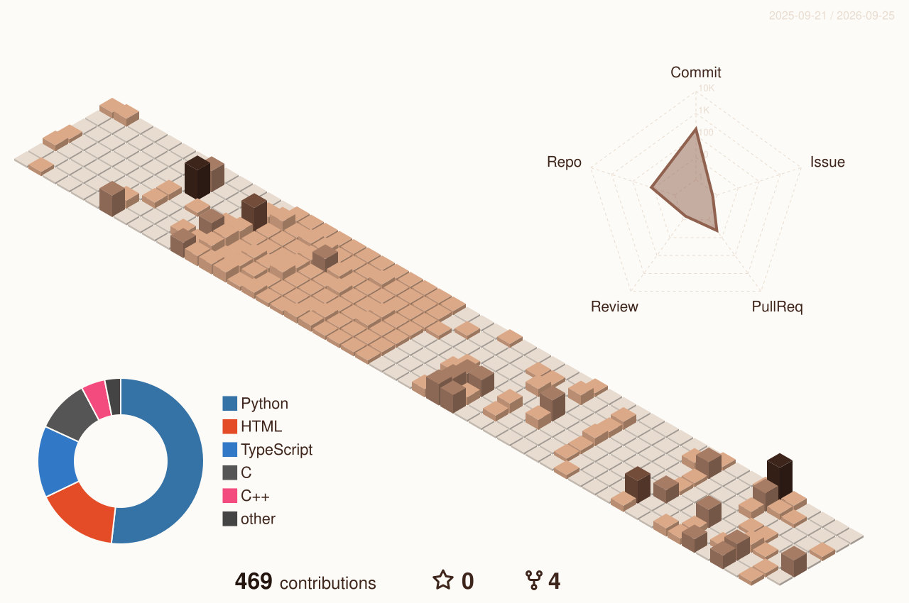

  
  
  
    
  
  <!-- Typing Animation - Professional -->
  
  
    
  
  <!-- Key Metrics -->
  

    
    
    
  

  
    
  
  <!-- Professional Links -->
  

    
    
    
  

  
    
  
  <!-- Interactive Element (keeps it fun) -->
  

---

## Performance & Statistics

  <picture>
    <source media="(prefers-color-scheme: dark)" srcset="https://github-readme-stats.vercel.app/api?username=charithra754-boop&show_icons=true&hide_border=true&bg_color=180D08&title_color=FAF8F5&icon_color=C28B72&text_color=E8DCD0&rank_icon=github">
    <source media="(prefers-color-scheme: light)" srcset="https://github-readme-stats.vercel.app/api?username=charithra754-boop&show_icons=true&hide_border=true&bg_color=FDFBF7&title_color=3E251C&icon_color=8F614E&text_color=734C3A&rank_icon=github">
    
  </picture>
  &nbsp;
  <picture>
    <source media="(prefers-color-scheme: dark)" srcset="https://github-readme-streak-stats.herokuapp.com/?user=charithra754-boop&hide_border=true&background=180D08&ring=C28B72&fire=FAF8F5&currStreakLabel=E8DCD0&sideNums=FAF8F5&sideLabels=C28B72&dates=bfa395">
    <source media="(prefers-color-scheme: light)" srcset="https://github-readme-streak-stats.herokuapp.com/?user=charithra754-boop&hide_border=true&background=FDFBF7&ring=8F614E&fire=DCA988&currStreakLabel=3E251C&sideNums=24150F&sideLabels=8F614E&dates=734C3A">
    
  </picture>

<picture>
  <source media="(prefers-color-scheme: dark)" srcset="https://github-readme-stats.vercel.app/api/top-langs/?username=charithra754-boop&layout=compact&hide_border=true&bg_color=180D08&title_color=FAF8F5&text_color=E8DCD0">
  <source media="(prefers-color-scheme: light)" srcset="https://github-readme-stats.vercel.app/api/top-langs/?username=charithra754-boop&layout=compact&hide_border=true&bg_color=FDFBF7&title_color=3E251C&text_color=734C3A">
  
</picture>

 

---

## Core Competencies

| **Multi-Agent Systems** | **Edge ML & Hardware** | **Blockchain Integration** | **Full-Stack Architecture** |
|---|---|---|---|
| Autonomous AI agents with 80%+ test coverage | Neural networks achieving 60% power reduction | Web3 protocol integration via MCP | Production-grade distributed systems |

 

## Featured Projects

<table width="100%">
  <tr>
    <td width="50%" valign="top" style="padding: 15px; background: linear-gradient(135deg, rgba(242, 237, 228, 0.5), rgba(237, 205, 197, 0.3)); border-radius: 8px; border-left: 4px solid #8f614e;">
      <h3 align="center" style="color: #3e322d; margin: 0 0 10px 0;">CortexCore: Clinical ECG Analysis</h3>
      

        Spiking Neural Network for ECG analysis reducing power consumption by 60% (100mW→40mW). Achieved 89.16% G-mean accuracy for arrhythmia detection with 47ms latency on edge devices.
      

      

        
        
        
      

    </td>
    <td width="50%" valign="top" style="padding: 15px; background: linear-gradient(135deg, rgba(242, 237, 228, 0.5), rgba(237, 205, 197, 0.3)); border-radius: 8px; border-left: 4px solid #8f614e; margin-left: 10px;">
      <h3 align="center" style="color: #3e322d; margin: 0 0 10px 0;">Astraeus: Satellite Operations</h3>
      

        PPO-based reinforcement learning agent for optimizing satellite data scheduling (+23.4% throughput). Physics-accurate 3D Digital Twin using CesiumJS for sub-second telemetry processing.
      

      

        
        
        
      

    </td>
  </tr>
  <tr>
    <td style="height: 15px;"></td>
  </tr>
  <tr>
    <td width="50%" valign="top" style="padding: 15px; background: linear-gradient(135deg, rgba(242, 237, 228, 0.5), rgba(237, 205, 197, 0.3)); border-radius: 8px; border-left: 4px solid #8f614e;">
      <h3 align="center" style="color: #3e322d; margin: 0 0 10px 0;">FinPilot: Financial AI System</h3>
      

        6-agent autonomous financial intelligence system with 80%+ test coverage and 100% auditability. Interactive ReasonGraph visualization dashboard for transparent AI decision-making in fintech.
      

      

        
        
        
      

    </td>
    <td width="50%" valign="top" style="padding: 15px; background: linear-gradient(135deg, rgba(242, 237, 228, 0.5), rgba(237, 205, 197, 0.3)); border-radius: 8px; border-left: 4px solid #8f614e; margin-left: 10px;">
      <h3 align="center" style="color: #3e322d; margin: 0 0 10px 0;">KisaanMitra: Agri Intelligence</h3>
      

        7-agent ecosystem for agricultural intelligence combining satellite data with autonomous systems. Targeting 16-40% post-harvest loss reduction for Indian smallholder farmers through ML-powered yield forecasting and irrigation optimization.
      

      

        
        
        
      

    </td>
  </tr>
  <tr>
    <td style="height: 15px;"></td>
  </tr>
  <tr>
    <td colspan="2" valign="top" style="padding: 15px; background: linear-gradient(135deg, rgba(242, 237, 228, 0.5), rgba(237, 205, 197, 0.3)); border-radius: 8px; border-left: 4px solid #8f614e;">
      <h3 align="center" style="color: #3e322d; margin: 0 0 10px 0;">Aya Wallet: Web3-AI Integration</h3>
      

        Custom Model Context Protocol (MCP) tool bridging AI agents with blockchain ecosystems. Verified integration achieving 40% interaction efficiency improvement. Pioneer work connecting advanced NLP with decentralized systems.
      

      

        
        
        
      

    </td>
  </tr>
</table>

 

### Recent Activity
<!--START_SECTION:activity-->
1. Merged PR [#2](https://github.com/MUKUL-PRASAD-SIGH/AetherSentrix-Trial/pull/2) in [MUKUL-PRASAD-SIGH/AetherSentrix-Trial](https://github.com/MUKUL-PRASAD-SIGH/AetherSentrix-Trial)
2. Opened PR [#2](https://github.com/MUKUL-PRASAD-SIGH/AetherSentrix-Trial/pull/2) in [MUKUL-PRASAD-SIGH/AetherSentrix-Trial](https://github.com/MUKUL-PRASAD-SIGH/AetherSentrix-Trial)
3. Merged PR [#1](https://github.com/MUKUL-PRASAD-SIGH/AetherSentrix-Trial/pull/1) in [MUKUL-PRASAD-SIGH/AetherSentrix-Trial](https://github.com/MUKUL-PRASAD-SIGH/AetherSentrix-Trial)
4. Opened PR [#1](https://github.com/MUKUL-PRASAD-SIGH/AetherSentrix-Trial/pull/1) in [MUKUL-PRASAD-SIGH/AetherSentrix-Trial](https://github.com/MUKUL-PRASAD-SIGH/AetherSentrix-Trial)
<!--END_SECTION:activity-->

 

## Technical Skills

### Core Languages

### AI/ML & Data Science

### Web & Cloud Architecture

### Blockchain & Web3

### DevOps & Tools

 

## Areas of Focus

  <table style="border: none; border-collapse: collapse; background: transparent;">
    <tr style="border: none;">
      <td style="border: none; padding: 15px; vertical-align: top; width: 33%;">
        <h4 align="center" style="color: #705e55;">Advanced AI & Neuromorphic Computing</h4>
        

          Spiking Neural Networks 
          Intel Loihi Architecture 
          Edge AI Optimization
        

      </td>
      <td style="border: none; padding: 15px; vertical-align: top; width: 33%;">
        <h4 align="center" style="color: #705e55;">Blockchain & Web3</h4>
        

          Smart Contract Security 
          Zero-Knowledge Proofs 
          AI-Web3 Integration
        

      </td>
      <td style="border: none; padding: 15px; vertical-align: top; width: 33%;">
        <h4 align="center" style="color: #705e55;">Autonomous Systems</h4>
        

          Multi-Agent Systems 
          Reinforcement Learning 
          Verifiable AI
        

      </td>
    </tr>
  </table>

 

## Contribution Visualization

  <picture>
    <source media="(prefers-color-scheme: dark)" srcset="profile-3d-contrib/profile-pastel-dark.svg">
    <source media="(prefers-color-scheme: light)" srcset="profile-3d-contrib/profile-pastel.svg">
    
  </picture>

 

---

## Let's Connect

**Interested in collaboration, innovation, or great technical conversations?**

I'm open to discussions about cutting-edge AI projects, blockchain applications, and building systems that matter. Reach out anytime.

 

 

---

**AI & Full-Stack Developer** | **System Builder** | **Technical Innovator**

Always learning. Always building. Always pushing forward.

